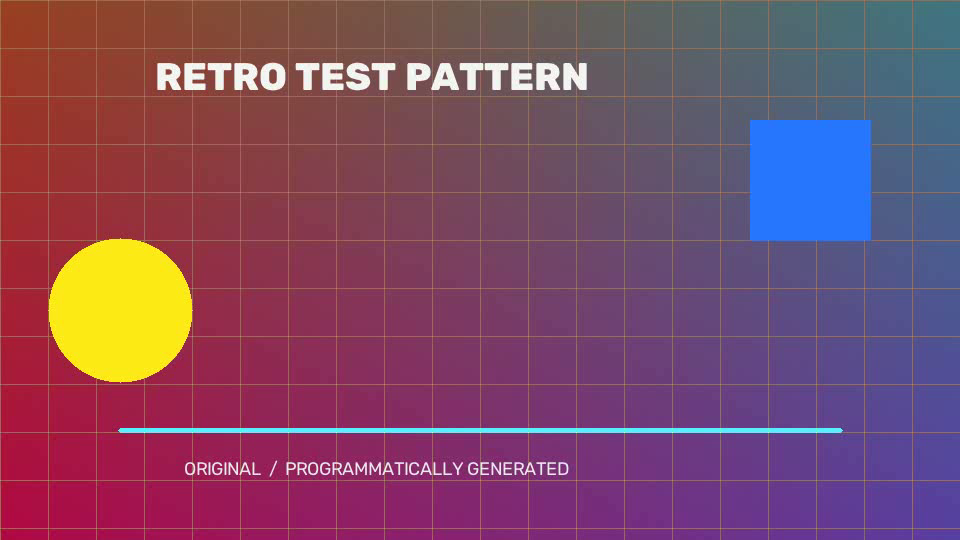
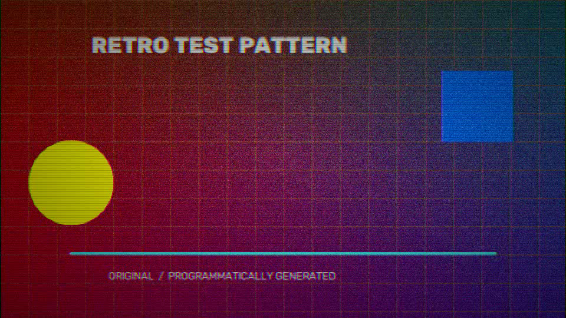

# Retro Video FX

A local Python video-processing utility for applying configurable retro visual effects to video files. It uses OpenCV and NumPy for frame processing, with both a command-line interface and a Tkinter GUI.

The included presets combine effects such as noise, pixelation, scanlines, vignette, flicker, and chromatic channel shift.

## Demo

Example generated from a programmatically created synthetic test clip using the project's VHS preset. No third-party film, animation, game, or other media is used.

| Original | VHS preset |
| --- | --- |
|  |  |

## Features

- Brightness and chromatic noise
- Pixelation and contrast adjustment
- CRT-style scanlines and vignette
- Frame-to-frame flicker
- Chromatic aberration through red/blue channel shift
- Built-in VHS, 80s, 90s, arcade, and horror presets
- CLI processing and a Tkinter GUI

## Installation

```bash
pip install opencv-python numpy
```

## GUI Usage

```bash
python retro_gui.py
```

Choose an input and output video, select a preset or adjust the controls, then start processing.

## CLI Usage

```bash
# VHS preset; process the first five seconds at 25% working resolution
python retro_fx.py input.mp4 -o output.mp4 --preset vhs --scale 0.25 -t 5

# Process a ten-second segment beginning at 30 seconds
python retro_fx.py input.mp4 -o output.mp4 --preset horror --scale 0.3 --start 30 -t 10

# Use selected custom effects
python retro_fx.py input.mp4 -o output.mp4 --noise 0.08 --pixel 8 --contrast 2.0 --no-scanlines
```

## Parameters

| Parameter | CLI option | GUI control | Description |
| --- | --- | --- | --- |
| Working scale | `--scale 0.25` | Slider | Processing-resolution ratio (`0.1`–`1.0`) |
| Start time | `--start 30` | Input | Segment start in seconds |
| Duration | `-t 5` | End time | Segment duration in seconds |
| Brightness noise | `--noise 0.05` | Slider | Luminance noise intensity |
| Chromatic noise | `--chroma-noise 0.05` | Slider | Color-channel noise intensity |
| Pixel size | `--pixel 4` | Slider | Pixelation block size |
| Contrast | `--contrast 1.6` | Slider | Contrast multiplier |
| Scanlines | `--no-scanlines` | Toggle | CRT-style horizontal lines |
| Vignette | `--no-vignette` | Toggle | Edge darkening |
| Flicker | `--no-flicker` | Toggle | Random brightness variation |
| Channel shift | `--no-color-shift` | Toggle | Red/blue channel displacement |

## Presets

| Preset | Effect combination |
| --- | --- |
| `vhs` | Chromatic noise, scanlines, flicker, and channel shift |
| `80s` | Stronger grain, channel shift, and vignette |
| `90s` | Lighter aging effects with more source detail retained |
| `arcade` | Large pixel blocks, scanlines, and high contrast |
| `horror` | Strong noise, high contrast, and dark vignette |

## Notes

- Video output is processed frame by frame through OpenCV.
- The current pipeline does not preserve audio.
- Processing time depends on input resolution and CPU. Lower `scale` values reduce the working resolution and can both speed up processing and strengthen the retro appearance.
